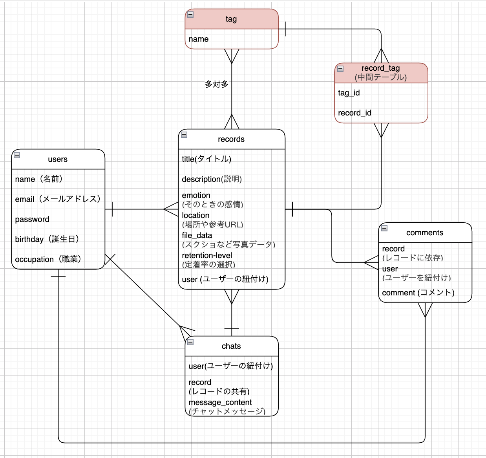
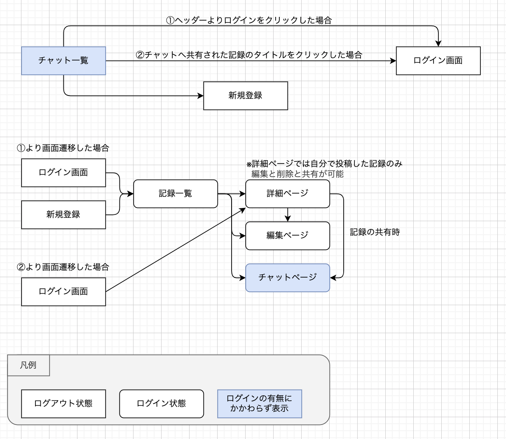
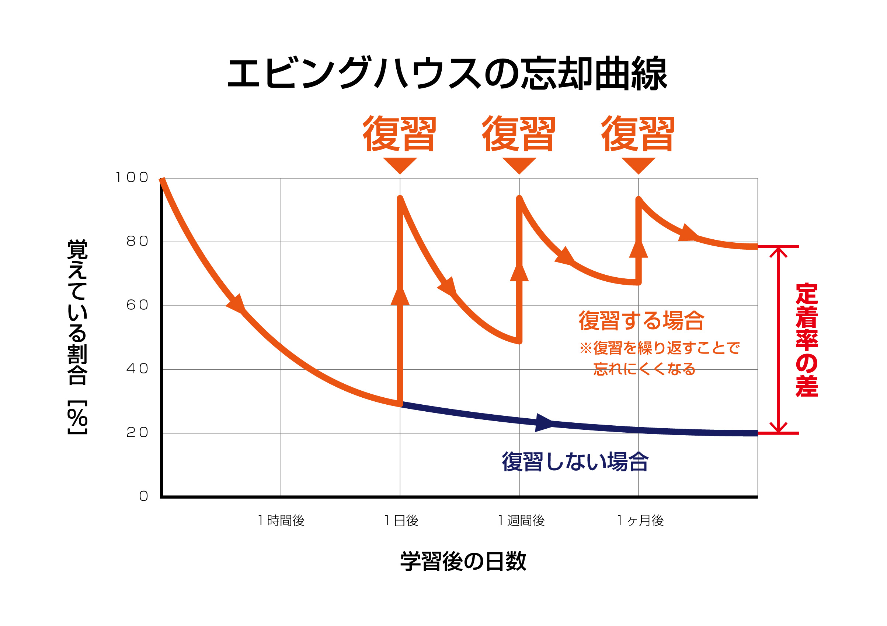

# アプリケーション名	
## Hibirog
# アプリケーション概要	このアプリケーションでできることを記載。
このアプリケーションでは日々の学んだことを記録することができます。また、学んだことをアウトプットする場としてチャットの機能も搭載しています。チャットではアウトプットのみならずコミュニケーションを取る場としても使えるようになっています。
# URL	
https://hibirog-41961.onrender.com
# テスト用アカウント	
### Basic認証  
id  :admin  
pass:2222   
  
### テスト用アカウント
test1
メールアドレス:test1@test.mail  
パスワード:test111  
  
test2
メールアドレス:test2@test.mail  
パスワード:test222  
  

# 利用方法	
- 新規登録をする
- 記録の新規投稿をする
- 記録はタイトル、説明の入力、定着率の選択が必須
- 一覧機能と詳細機能から削除と編集が可能
- 定着率が上から4,5番目の場合チャットに共有できる
- チャットはメッセージのみの入力もできる
# アプリケーションを作成した背景
このアプリケーションは普段の学びを一元管理したい人に向けて作成されています。  
学生や社会人の方には資格勉強や覚えたい仕事の内容など  
主婦の方にはレシピなど、覚えたいことを記録により蓄積していくことができます。  
似たようなアプリに「notion」というアプリがありますが、機能を一部に限定し、シンプルな構造にすることで一元管理がしやすくなっています。
# 実装した機能について
- ログアウト状態ではチャットの一覧が表示されます
  
- ログイン状態では記録一覧が表示されます
  
- 記録投稿機能
  
- 検索機能
  
- 編集機能
  
- 削除機能
  
- チャットに共有機能
  
- コメント投稿機能
  
- コメント削除機能
  
- チャット投稿機能
  
- チャット削除機能
  
# 実装予定の機能	
- 定着率ごとにソートし、選択した定着率の記録のみを表示する
- タグをつけて、タグが共通しているもののみを表示
- アプリ内リマインド機能、復習の促進を促すリマインドを追加予定
# データベース設計	

赤枠のテーブルは追加で実装予定です。(タグ付け機能)
# 画面遷移図

# 開発環境	
- フロントエンド
  - HTML, CSS, (ERBによるRuby)
- バックエンド
  - Ruby (Ruby on Rails)
- テスト
  - RSpec (Ruby on RailsのGem)
- バージョン管理
  - GitHub
- タスク管理
  - GitHub Issues, GitHub Projects
# ローカルでの動作方法	git cloneしてから、ローカルで動作をさせるまでに必要なコマンドを記載。
# 工夫したポイント	
現代は情報量が多く、技術の進歩も早いため、学習した内容を効率的に定着させるには、適切な記録と迅速な検索が不可欠です。しかし、手書きのメモや複数のアプリケーションに分散した電子メモは、情報の検索に時間を要し、その過程で他の情報が目に入り集中力が途切れがちです。また、検索時間の増加は学習意欲の低下にも繋がります。  
  
そこで、本アプリケーションは、情報の検索時間を最小限に抑え、学習内容の定着を促進することを目的としています。具体的には、機能を敢えてシンプルに絞り込むことで、ユーザーは必要な情報に素早くアクセスでき、学習に集中できる環境を提供します。  
# 改善点	
- 定着率ごとにソートする機能
  - 定着率ごとに並び替えるボタンを作成し、一覧の中から指定された定着率のものを取得する
- タグの機能をつけてタグごとにソートする機能
  - タグと記録を繋ぐ中間テーブルを設けて、記録にタグを紐づける
- リマインド機能
  - アプリ内に通知がされるように、JavaScriptのDOMを使用して、定期的に通知がされるようにする
  - その際、記録の投稿から計算して以下の忘却曲線ごとに復習をアプローチできるようにする

引用元:https://sprout-juku.com/knowledge/ebbinghaus
# 制作時間	
約80時間  
計画:15時間  
実装:65時間

--------------------

# テーブル設計
## Usersテーブル

|Column             |Type         |Options                  |
|-------------------|-------------|-------------------------|
|name               |string       |null: false              |
|email              |string       |null: false, unique: true|
|encrypted_password |string       |null: false              |
|birth_date         |date         |null: false              |
|occupation_id      |integer      |null: false              | 

### Association
- has_many :records
- has_many :chats
- has_many :comments

## recordsテーブル

|Column             |Type         |Options                  |
|-------------------|-------------|-------------------------|
|title              |string       |null: false              |
|description        |text         |null: false              |
|emotion            |string       |null: false              |
|location           |string       |null: false              |
|file_data          |string       |カラムは不要               | 
|retention-level_id |integer      |null: false              | 
|user               |references   |null: false, foreign_key: true| 

### Association
- has_one :chat
- belongs_to :user
- has_many :comments

## chatsテーブル

|Column             |Type         |Options                  |
|-------------------|-------------|-------------------------|
|user               |references   |null: false, foreign_key: true|
|record             |references   |null: false, foreign_key: true|
|message_content    |text         |null: false              |
|image              |string       |                         |

### Association
- belongs_to :user
- belongs_to :record

## commentsテーブル

|Column             |Type         |Options                  |
|-------------------|-------------|-------------------------|
|user               |references   |null: false, foreign_key: true|
|record             |references   |null: false, foreign_key: true|
|comment            |text         |null: false              |

### Association
- belongs_to :user        |コメントはユーザーに属する
- belongs_to :record      |コメントはレコードに属する

## tagsテーブル(追加で実装中)

|Column             |Type         |Options                  |
|-------------------|-------------|-------------------------|
|name               |string       |null: false              |

### Association
- has_many :record_tags, dependent: :destroy  |tagが消された場合にはrecord_tagsも消える
- has_many :records, through: :record_tags    |recordの橋渡しとしてrecord_tagsを経由

## record_tags中間テーブル(追加で実装中)

|Column             |Type         |Options                  |
|-------------------|-------------|-------------------------|
|record             |references   |null: false, foreign_key: true|
|tag                |references   |null: false, foreign_key: true|

### Association
- belongs_to :record    |レコードに属する
- belongs_to :tag       |タグに属する